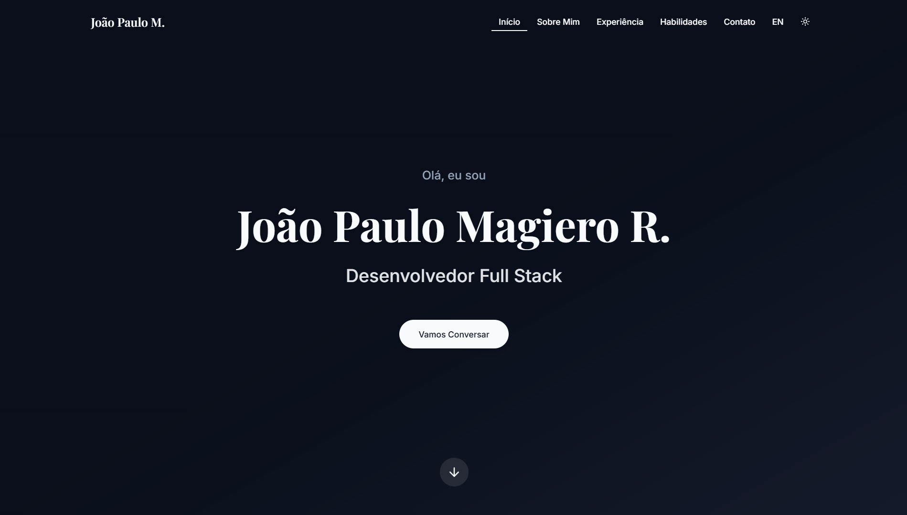

# Modern Portfolio Website

A sleek, responsive portfolio website built with modern web technologies. This portfolio features a clean design with smooth animations, dark/light theme support, and multilingual capabilities.



## ✨ Features

- **Responsive Design**: Fully responsive layout that works beautifully on all devices
- **Dark/Light Theme**: Toggle between dark and light modes with smooth transitions
- **Multilingual Support**: Switch between English and Portuguese translations
- **Smooth Animations**: Page transitions and scroll animations using Framer Motion
- **Modern UI**: Clean and professional interface with a focus on user experience
- **Interactive Elements**: Hover effects and interactive components throughout
- **Mobile-First Navigation**: Hamburger menu for mobile devices with smooth transitions

## 🛠 Technologies

- **React**: UI library for building the interface
- **TypeScript**: Type-safe JavaScript
- **Vite**: Next-generation frontend tooling
- **Tailwind CSS**: Utility-first CSS framework

## 🚀 Getting Started

1. Clone the repository
```bash
git clone
```

2. Install dependencies
```bash
npm install
```

3. Start the development server
```bash
npm run dev
```

4. Build for production
```bash
npm run build
```

## 🎨 Features Breakdown

### Theme Switching
- Seamless dark/light mode transition
- Theme preference persistence
- System theme detection

### Internationalization
- English and Portuguese language support
- Easy language switching
- Persistent language preference
- Automatic language detection

### Animations
- Scroll-triggered animations
- Hover effects
- Page load animations
- Smooth transitions

### Responsive Design
- Mobile-first approach
- Adaptive layouts
- Touch-friendly interactions
- Responsive typography

## 📱 Mobile Support

The portfolio is fully responsive and includes:
- Mobile navigation menu
- Touch-friendly interactions
- Optimized layouts for all screen sizes
- Performance optimizations for mobile devices